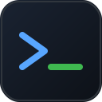
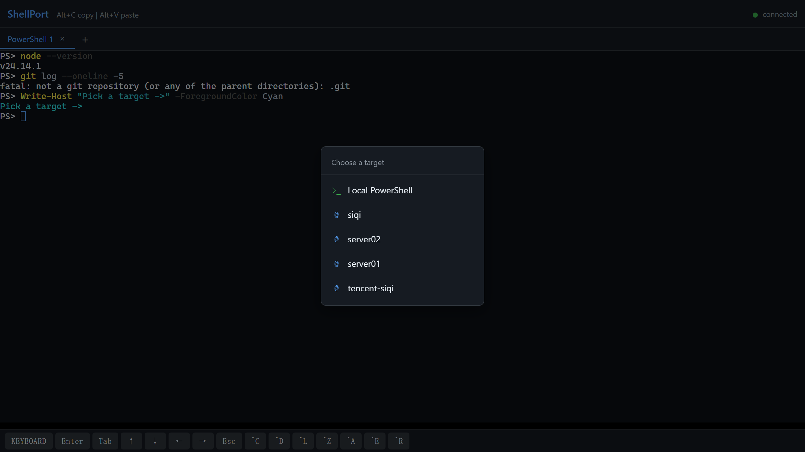
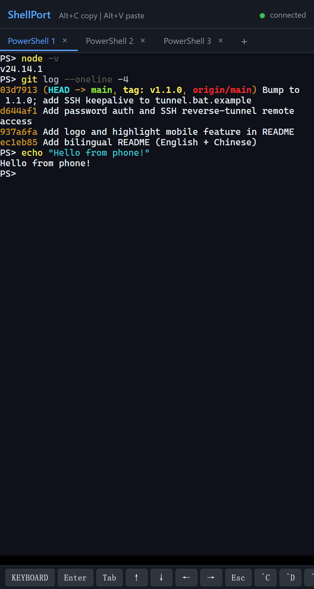

<p align="center">
  
</p>

<h1 align="center">ShellPort</h1>

<p align="center">
  <i>Run a terminal at home, control it from anywhere.</i>
</p>

<p align="center">
  <a href="https://github.com/siqi2000/ShellPort/releases/latest"></a>
  
  
  
  
</p>

<p align="center">
  
</p>

<p align="center"><b><a href="#english">English</a> | <a href="#中文">中文</a></b></p>

---

## English

Web-based terminal sharing tool. Run a terminal on your home computer, then access and control it from any device — phone, tablet, or another PC — either on the same LAN or **anywhere on the internet** via a cheap relay server.

**Table of contents**
- [Features](#features)
- [Quick Start (LAN only)](#quick-start-lan-only)
- [Remote Access (over the internet)](#remote-access-over-the-internet)
  - [Setup](#setup)
  - [Security notes](#security-notes)
- [Tech Stack](#tech-stack)
- [How It Works](#how-it-works)
- [Releases & changelog](#releases--changelog)
- [License](#license)

### Features

- **Multi-device access** — open the same terminal session from multiple devices simultaneously
- **Session management** — create, switch, rename, and close multiple terminal tabs
- **Multi-target sessions** — each new tab can be a local shell, an **SSH connection** to any host from your `~/.ssh/config` (auto-discovered, zero extra configuration), or a **TCP bridge** target (lets you reach a Windows machine that has no SSH server, via a tiny `home_bridge.js` + reverse tunnel)
- **Live target reachability** — the picker pings every target in parallel and shows a green/red dot, so you know which servers are up before you click
- **Scrollback replay** — new clients joining an existing session see the full output history
- **Real-time sync** — session list updates are broadcast to all connected clients instantly
- **Password login** — cookie-based auth, password configured via `.env`
- **Remote access via SSH reverse tunnel** — expose your home machine through a public relay server, on-demand

> [!TIP]
> **Mobile-friendly** — bottom toolbar with common keys (Enter, Tab, arrows, Ctrl combos) and a keyboard toggle for smooth scrolling

<p align="center">
  
</p>

### Quick Start (LAN only)

```bash
npm install
```

Create a `.env` file in the project root:

```
SHELLPORT_PASSWORD=your_password_here
```

Then start the server:

```bash
npm start
```

The server starts on port 3000. Access it at:

- **Local**: http://localhost:3000
- **Other devices on LAN**: http://\<your-lan-ip\>:3000 (printed in the console on startup)

You'll be redirected to `/login` and prompted for the password.

### Remote Access (over the internet)

The goal: run ShellPort on a home machine that has **no public IP** (behind a router/NAT), and still reach it from anywhere — phone on cellular, laptop in a café, etc.

The trick is an **SSH reverse tunnel** through a small cloud server that you already own (or rent — even the cheapest 1-core VPS works, since it's only forwarding TCP):

```
  [Your phone / laptop]
          │
          │  http://<relay-server-ip>:8080
          ▼
  ┌───────────────────┐
  │   Relay server    │   (public IP, e.g. a $5/mo VPS)
  │  port 8080  ◄─────┼──┐
  └───────────────────┘  │
                         │  SSH reverse tunnel (initiated FROM home)
                         │  ssh -R 0.0.0.0:8080:localhost:3000 relay
                         │
  ┌───────────────────┐  │
  │   Home machine    │──┘
  │  ShellPort :3000  │
  └───────────────────┘
```

**Why this approach?**

- ✅ **No port forwarding** on your home router — works behind any NAT, including dorms, hotels, mobile hotspots
- ✅ **No dynamic-DNS** needed — your home IP can change freely
- ✅ **The relay server never stores anything** — it only forwards bytes; if you stop the tunnel, the entry point disappears
- ✅ **Fully on-demand** — you control when remote access is open by starting/stopping `tunnel.bat`
- ✅ **Cheap** — any cloud VPS with a public IP works (Tencent Cloud Lighthouse, AWS Lightsail, DigitalOcean droplet, etc.)

#### Setup

**1. On your relay server** (one-time):

Make sure OpenSSH server is installed and you can SSH in with a key. Then enable remote port binding by editing `sshd_config`:

- **Linux**: `/etc/ssh/sshd_config` → add `GatewayPorts yes` → `sudo systemctl restart sshd`
- **Windows Server**: `C:\ProgramData\ssh\sshd_config` → add `GatewayPorts yes` → `Restart-Service sshd`

Open port 8080 (or whatever port you pick) in:
- The cloud provider's firewall / security group (inbound TCP 8080 from `0.0.0.0/0`)
- The OS firewall (Windows: `New-NetFirewallRule -DisplayName ShellPort -Direction Inbound -Protocol TCP -LocalPort 8080 -Action Allow`; Linux: `ufw allow 8080`)

**2. On your home machine** (one-time):

Set up an SSH alias in `~/.ssh/config` so you don't have to type the full host every time:

```
Host myrelay
    HostName 1.2.3.4
    User your_user
    Port 22
    IdentityFile ~/.ssh/id_ed25519
```

Copy the example tunnel script and set `SERVER_ALIAS` to your alias name:

```bash
cp tunnel.bat.example tunnel.bat
# then edit tunnel.bat and change SERVER_ALIAS=myrelay if needed
```

(`tunnel.bat` is gitignored, so your personal config won't leak.)

**3. Each time you want remote access:**

```bash
# Terminal 1 — start ShellPort locally
npm start

# Terminal 2 (or just double-click) — open the tunnel
tunnel.bat
```

Now visit `http://<relay-server-ip>:8080` from anywhere, log in, and you're in your home shell.

To **close** remote access: just close the `tunnel.bat` window (or `Ctrl+C`). The public entry point disappears immediately. ShellPort itself keeps running locally.

#### Security notes

- The login password (in `.env`) is the **only** thing protecting your home shell from the internet — pick a strong one. The `.env` file is gitignored.
- Tokens are stored in memory only and reset on every server restart.
- This setup uses **HTTP**, not HTTPS. For most personal use that's fine since the password is what matters and traffic is over the public internet anyway. If you want TLS, terminate it on the relay with nginx + Let's Encrypt and proxy to `127.0.0.1:8080`.
- Want to be extra paranoid? Bind the tunnel to `127.0.0.1:8080` instead of `0.0.0.0:8080` on the relay, then SSH-port-forward from your client device. Then nothing is exposed publicly at all.

### Tech Stack

- **Backend**: Node.js, Express, ws (WebSocket), node-pty
- **Frontend**: xterm.js, vanilla JavaScript
- **Remote access**: SSH reverse tunnel (`ssh -R`)

### How It Works

The server spawns a PTY process (PowerShell on Windows, bash on Linux/macOS) for each terminal session. Client browsers connect via WebSocket and render terminal output using xterm.js. Multiple clients can attach to the same session — keyboard input from any client is forwarded to the PTY, and output is broadcast to all viewers.

For remote access, `ssh -R 0.0.0.0:8080:localhost:3000 relay` tells the relay's sshd to listen on its own port 8080 and tunnel every byte over the existing SSH connection back to `localhost:3000` on the home machine. No new daemon, no extra software on the relay — just OpenSSH.

### Releases & changelog

See [GitHub Releases](https://github.com/siqi2000/ShellPort/releases) for the full version history. Highlights:

- **[v1.3.0](https://github.com/siqi2000/ShellPort/releases/tag/v1.3.0)** — Multi-question login, live target reachability indicators, and TCP bridge targets (reach a Windows machine without OpenSSH server)
- **[v1.2.0](https://github.com/siqi2000/ShellPort/releases/tag/v1.2.0)** — Multi-target sessions: each tab can be a local shell or an SSH connection to any host from `~/.ssh/config`
- **[v1.1.0](https://github.com/siqi2000/ShellPort/releases/tag/v1.1.0)** — Password login + remote access via SSH reverse tunnel through a relay server

### License

ISC

---

## 中文

基于 Web 的终端共享工具。在家里的电脑上运行终端，然后从任何设备（手机、平板、另一台电脑）来访问和操控 —— 既支持局域网，也可以**通过一台便宜的中转服务器从公网任意位置访问**。

**目录**
- [功能特性](#功能特性)
- [快速开始（仅局域网）](#快速开始仅局域网)
- [远程访问（公网）](#远程访问公网)
  - [配置步骤](#配置步骤)
  - [安全说明](#安全说明)
- [技术栈](#技术栈)
- [工作原理](#工作原理)
- [版本历史](#版本历史)
- [许可证](#许可证)

### 功能特性

- **多设备访问** —— 多个设备可以同时打开并操控同一个终端会话
- **会话管理** —— 创建、切换、重命名、关闭多个终端标签页
- **多目标会话** —— 每个新 tab 可以是本地 shell、任意一台服务器的 **SSH 连接**(从 `~/.ssh/config` 自动读取，新增服务器零配置)，或者一个 **TCP 桥接目标**(让没装 SSH 服务端的 Windows 机器也能作为目标，通过一个小小的 `home_bridge.js` + 反向隧道实现)
- **实时连通性指示** —— 选择器并发探测每个目标的可达性，绿点/红点一目了然，点之前就知道服务器在不在
- **历史回放** —— 新设备加入已有会话时自动回放之前的输出内容
- **实时同步** —— 会话列表变更会即时推送给所有已连接的客户端
- **密码登录** —— 基于 cookie 的认证，密码通过 `.env` 配置
- **SSH 反向隧道远程访问** —— 通过公网中转服务器按需暴露家里的机器

> [!TIP]
> **移动端适配** —— 底部工具栏提供常用按键（回车、Tab、方向键、Ctrl 组合键），支持键盘开关以便自由滑动浏览

<p align="center">
  
</p>

### 快速开始（仅局域网）

```bash
npm install
```

在项目根目录创建 `.env` 文件：

```
SHELLPORT_PASSWORD=你的密码
```

然后启动服务器：

```bash
npm start
```

服务器默认运行在 3000 端口。访问地址：

- **本机访问**: http://localhost:3000
- **局域网其他设备**: http://\<局域网IP\>:3000（启动时控制台会打印）

打开后会跳转到 `/login` 输入密码。

### 远程访问（公网）

目标：让家里那台**没有公网 IP**（在路由器/NAT 后面）的机器上跑 ShellPort，依然可以从任何地方访问 —— 4G 上的手机、咖啡馆里的笔记本，等等。

核心思路是用一台你已有（或者花点小钱租）的云服务器做**中转**，通过 **SSH 反向隧道**把家里的端口透出去。哪怕是最便宜的 1 核 VPS 也够用，因为它只是在转发 TCP：

```
  [你的手机 / 笔记本]
          │
          │  http://<中转服务器IP>:8080
          ▼
  ┌───────────────────┐
  │     中转服务器      │   (有公网 IP，比如月付几块的 VPS)
  │   端口 8080  ◄─────┼──┐
  └───────────────────┘  │
                         │  SSH 反向隧道（从家里发起）
                         │  ssh -R 0.0.0.0:8080:localhost:3000 relay
                         │
  ┌───────────────────┐  │
  │     家里的机器       │──┘
  │   ShellPort :3000  │
  └───────────────────┘
```

**为什么用这种方案？**

- ✅ **不需要在家里路由器上做端口映射** —— 任何 NAT 都能用，包括宿舍、酒店、手机热点
- ✅ **不需要 DDNS** —— 你家公网 IP 怎么变都无所谓
- ✅ **中转服务器不存任何东西** —— 它只转发字节流；隧道一停，入口立刻消失
- ✅ **完全按需开关** —— 由你决定什么时候开放远程访问，启动/关闭 `tunnel.bat` 即可
- ✅ **便宜** —— 任何带公网 IP 的云 VPS 都可以（腾讯云轻量、阿里云、AWS Lightsail、DigitalOcean 都行）

#### 配置步骤

**1. 中转服务器**（一次性）：

确保已安装 OpenSSH server 且可以用密钥登录。然后修改 `sshd_config` 允许远程端口绑定：

- **Linux**：`/etc/ssh/sshd_config` → 加 `GatewayPorts yes` → `sudo systemctl restart sshd`
- **Windows Server**：`C:\ProgramData\ssh\sshd_config` → 加 `GatewayPorts yes` → `Restart-Service sshd`

放行 8080 端口（或任何你选的端口）：
- 云厂商的**安全组 / 防火墙**：入站 TCP 8080，来源 `0.0.0.0/0`
- 操作系统防火墙：
  - Windows: `New-NetFirewallRule -DisplayName ShellPort -Direction Inbound -Protocol TCP -LocalPort 8080 -Action Allow`
  - Linux: `ufw allow 8080`

**2. 家里的机器**（一次性）：

在 `~/.ssh/config` 配一个 SSH 别名，省得每次输完整地址：

```
Host myrelay
    HostName 1.2.3.4
    User your_user
    Port 22
    IdentityFile ~/.ssh/id_ed25519
```

把示例脚本复制一份，然后设置 `SERVER_ALIAS` 为你的别名：

```bash
cp tunnel.bat.example tunnel.bat
# 然后编辑 tunnel.bat，把 SERVER_ALIAS=myrelay 改成你的别名
```

（`tunnel.bat` 已加入 `.gitignore`，不会泄露你的个人配置。）

**3. 每次想要远程访问时：**

```bash
# 终端 1 —— 本地启动 ShellPort
npm start

# 终端 2（或者直接双击）—— 开启隧道
tunnel.bat
```

然后在任何地方打开浏览器访问 `http://<中转服务器IP>:8080`，输密码登录，就进到你家里的 shell 了。

要**关闭**远程访问：直接关掉 `tunnel.bat` 的黑窗口（或 `Ctrl+C`）。公网入口立即消失。本地的 ShellPort 不受影响，继续在局域网可用。

#### 安全说明

- `.env` 里的登录密码是你家 shell 暴露在公网时**唯一的防线** —— 务必用强密码。`.env` 已加入 `.gitignore`。
- Token 只存在内存里，服务器一重启就全失效。
- 这套方案走的是 **HTTP**，不是 HTTPS。对个人使用通常够用，因为关键是密码，而流量本身已经在公网上跑了。如果想加 TLS，可以在中转服务器上用 nginx + Let's Encrypt 终止 HTTPS，再反代到 `127.0.0.1:8080`。
- 想再保守一点？把隧道改成只绑定到中转服务器的 `127.0.0.1:8080`（去掉 `0.0.0.0:`），然后在客户端用 SSH 端口转发访问 —— 这样公网上根本看不到任何端口。

### 技术栈

- **后端**: Node.js、Express、ws（WebSocket）、node-pty
- **前端**: xterm.js、原生 JavaScript
- **远程访问**: SSH 反向隧道（`ssh -R`）

### 工作原理

服务器为每个终端会话生成一个 PTY 进程（Windows 上为 PowerShell，Linux/macOS 上为 bash）。浏览器通过 WebSocket 连接服务器，使用 xterm.js 渲染终端输出。多个客户端可以连接到同一个会话 —— 任意客户端的键盘输入都会转发到 PTY，输出广播给所有连接者。

至于远程访问部分，`ssh -R 0.0.0.0:8080:localhost:3000 relay` 这条命令告诉中转服务器的 sshd：在它自己的 8080 端口监听，并把每一个收到的字节通过已经建立的 SSH 连接，转发回家里机器的 `localhost:3000`。中转服务器上不需要装任何额外的程序，只要 OpenSSH 就够了。

### 版本历史

完整的版本记录在 [GitHub Releases](https://github.com/siqi2000/ShellPort/releases)。重点版本:

- **[v1.3.0](https://github.com/siqi2000/ShellPort/releases/tag/v1.3.0)** —— 多问题验证登录、目标实时可达性指示器、TCP 桥接目标(无需在远端机器装 OpenSSH server 也能把它当成目标)
- **[v1.2.0](https://github.com/siqi2000/ShellPort/releases/tag/v1.2.0)** —— 多目标会话:每个 tab 可以是本地 shell,也可以是 `~/.ssh/config` 里任意一台服务器的 SSH 连接
- **[v1.1.0](https://github.com/siqi2000/ShellPort/releases/tag/v1.1.0)** —— 密码登录 + 通过中转服务器的 SSH 反向隧道远程访问

### 许可证

ISC
